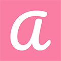
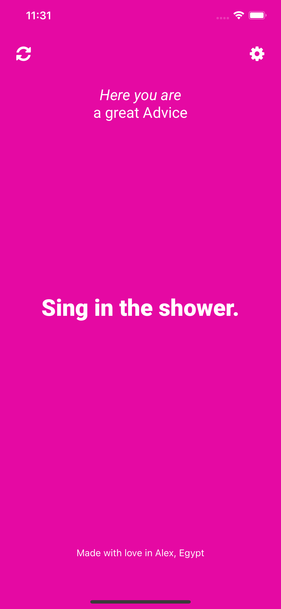
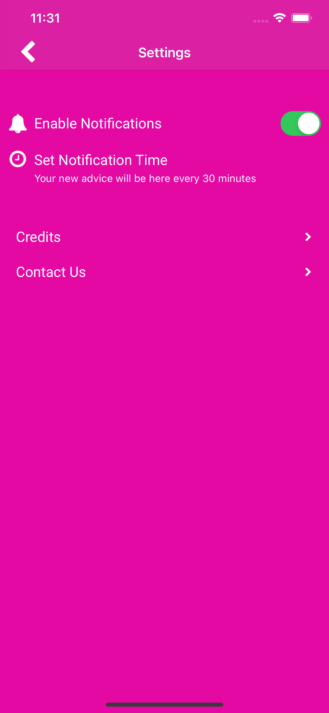
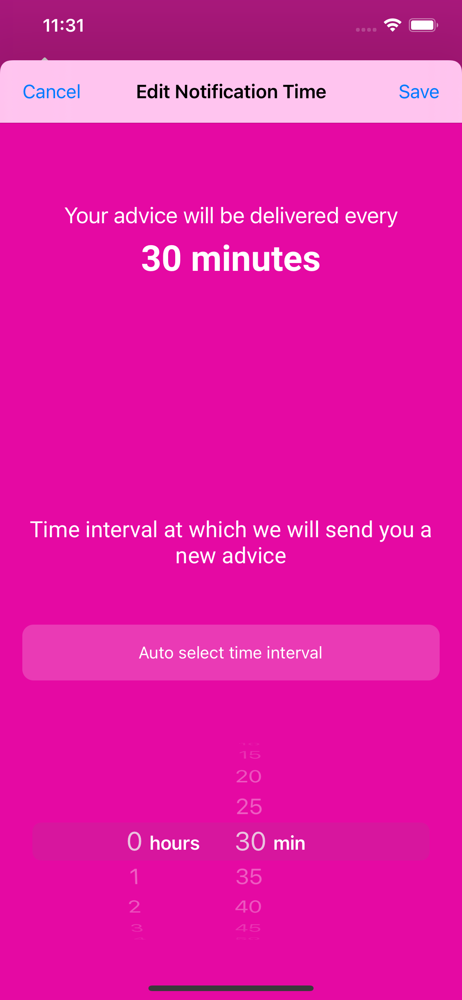

<h1 align="center">
   
  <a href="https://apps.apple.com/us/app/advicee/id1567107568">Advicee</a> 
</h1>

  
  

---

## Introduction
Advicee app is your fantastic way to stay motivated to go forward for knowing new fields to discover the world, a bit of good advice can change your way of thinking, so start now and learn more by reading and apply your new way of thinking to make you better.

## Screenshots
   
